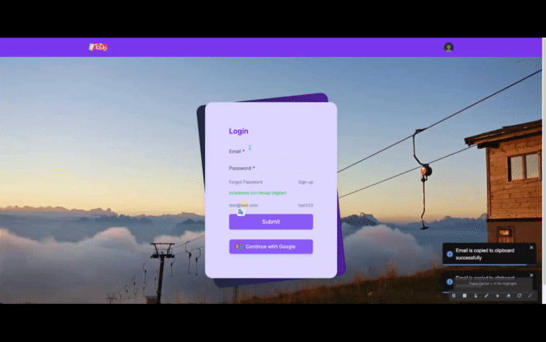

<a name="readme-top"></a>
 
 
<!-- PROJECT LOGO -->
<br />
<div align="center">
   
  <a href="https://github.com/ibrsec/todo-nowie/">
    
  </a>

  <h3 align="center">Todo Nowie</h3>

  <p align="center">
    An awesome Todo App
    <a href="https://github.com/ibrsec/todo-nowie"><strong>Explore the docs »</strong></a>
    <br />
    <br />
    <a href="https://todo-nowie-nextjs.vercel.app/">View Demo</a>
    ·
    <a href="https://github.com/ibrsec/todo-nowie/issues">Report Bug</a>
    ·
    <a href="https://github.com/ibrsec/todo-nowie/issues">Request Feature</a>
  </p>
</div>


<!-- TABLE OF CONTENTS -->
<details>
  <summary>📎 Table of Contents 📎 </summary>
  <ol>
    <li><a href="#about-the-project">About The Project</a></li>
     <!-- <li><a href="#figma">Figma</a></li> -->
     <li><a href="#overview">Overview</a></li>
     <li><a href="#quick-setup">Quick Setup</a></li>
     <li><a href="#directory-structure">Directory structure</a></li>
     <li><a href="#built-with">Built With</a></li>
    <!-- <li>
      <a href="#getting-started">Getting Started</a>
      <ul>
        <li><a href="#prerequisites">Prerequisites</a></li>
        <li><a href="#installation">Installation</a></li>
      </ul>
    </li>
    <li><a href="#usage">Usage</a></li>
    <li><a href="#roadmap">Roadmap</a></li>
    <li><a href="#contributing">Contributing</a></li>
    <li><a href="#license">License</a></li>
    <li><a href="#contact">Contact</a></li>
    <li><a href="#acknowledgments">Acknowledgments</a></li> -->

    
  </ol>
</details>


---

<!-- ABOUT THE PROJECT -->
<a name="about-the-project"></a>
## ℹ️ About The Project

[](https://todo-nowie-nextjs.vercel.app/)


<p align="right">(<a href="#readme-top">back to top</a>)</p>


---

<!-- ## Figma 

<a href="https://www.figma.com/file/ePyCHKsx2ODB32uLgyUEEd/bootstrap-home-page?type=design&node-id=0%3A1&mode=design&t=edDzadCB9Ev5FS1a-1">Figma Link</a>  

  <p align="right">(<a href="#readme-top">back to top</a>)</p>


--- -->
<a name="overview"></a>
## 👀 Overview

📦 Used mock api  for store todo data </br>
🎯 Used next js react environment, context api,next app-routing,tailwind ,next fetch, react-toastify, firebase, cypress </br>
🖥 User can Register or login with the ready credentials on the login page, Contents can be accessed after logging in! </br>
🔩 After login there is  a few page like dashboard,oldotodos, big todos</br>
💪 User can track, add, delete, edit, change status, and manage daily and undaily todo tasks</br>
🌱 User can add steps to the tasks and manage them</br>
🐞 User can access to the todo tasks according to their dates under old todos tab   </br>
🏀 User can create and manage big tasks under big todos tasks
🌱 User can add and manage the steps of the big tasks and he can make these step daily task of the current day</br> 
</br>


<p align="right">(<a href="#readme-top">back to top</a>)</p>


<a name="quick-setup"></a>
## 🛫 Quick Setup

```sh
# clone the project
git clone https://github.com/ibrsec/todo-nowie.git

# enter the project directory
cd todo-nowie

# install dependency
npm install || yarn install

# develop
npm run dev || yarn start
```

<p align="right">(<a href="#readme-top">back to top</a>)</p>


<!-- ## 🐞 Debug

 -->


<a name="directory-structure"></a>
## 📂 Directory structure 

```diff
todo-nowie  (folder)
  |          
  |---cypress (folder) 
  |                
  |---public (folder) 
  |                
+ |---src (folder) 
  |     |---assests (folder)  
  |     |           
  |     |---components (folder) 
  |     |    
  |     |    
  |     |---app (folder)       
  |     |     |---(public) (folder) 
  |     |     |       |---layout.jsx
  |     |     |       |---login (folder) 
  |     |     |       |       └---layout.jsx       
  |     |     |       |       └---page.jsx       
  |     |     |       |
  |     |     |       └---register (folder) 
  |     |     |              └---layout.jsx       
  |     |     |              └---page.jsx       
  |     |     |
  |     |     |---(private) (folder) 
  |     |     |       |---layout.jsx
  |     |     |       |---dashboard (folder) 
  |     |     |       |       |---components (folder) 
  |     |     |       |       |---layout.jsx       
  |     |     |       |       └---page.jsx       
  |     |     |       |
  |     |     |       |---oldtodos (folder) 
  |     |     |       |       |---components (folder) 
  |     |     |       |       |---layout.jsx       
  |     |     |       |       └---page.jsx       
  |     |     |       |
  |     |     |       |---bigtodos (folder) 
  |     |     |       |       |---components (folder) 
  |     |     |       |       |---layout.jsx       
  |     |     |       |       └---page.jsx       
  |     |     |       |
  |     |     |       └---detail (folder) 
  |     |     |               └---[id] (folder) 
  |     |     |                      └---components (folder) 
  |     |     |               |---layout.jsx       
  |     |     |               └---page.jsx        
  |     |     |
  |     |     |---global.css 
  |     |     |---layout.js 
  |     |     └---page.js  
  |     |          
  |     |---context (folder)       
  |     |     |---AuthProvider.jsx  
  |     |     └---TodoProvider.jsx       
  |     |          
  |     |---auth (folder)        
  |     |     └---auth.js           
  |     |          
  |     └---helper (folder)        
  |          └---ToastifyNotify.js       
  |      
  |----next.config.mjs
  |----jsconfig.json
  |----postcss.config.mjs
  |----package.json
  |----yarn.lock
  |----tailwind.config.js
  |----cypress.config.js
  |----.env.local
  └----readme.md 
```

<p align="right">(<a href="#readme-top">back to top</a>)</p>

---

<a name="built-with"></a>
### 🏗️ Built With

 
<!-- https://dev.to/envoy_/150-badges-for-github-pnk  search skills-->

 
  
  
 <!--   -->
 <!--   -->
 <!--   -->
  
  
 <!--   -->
  

 <!--  
  
   -->
  


 <!--   -->

 <!--   -->

 <!--   -->
  
 <!--   -->
 <!--   -->
  
 


 
<p align="right">(<a href="#readme-top">back to top</a>)</p>


